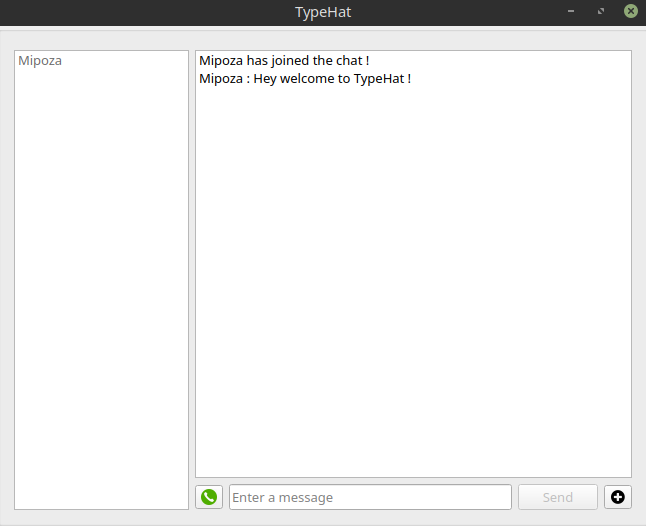

TypeHat is a simple utility for having safe and secure communications.

You can share pictures and files and make a group voice call. Any type of communication (message, files, call)
are encrypted with hybrid encryption that uses RSA and AES.

The libraries required for python3 are:
cryptodome, cryptography, PyQt5 (use pip)

